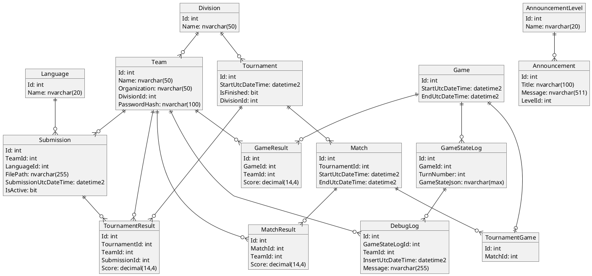

# Domain Models

---

---

**Division**

- Id
- Name

---

**Language**

- Id
- Name

---

**Team**

- Id
- Name
- Organization
- Division
- Password
- Submissions

---

**Submission**

- Id
- TeamId
- Language
- FileLocation
- SubmissionDateTime
- IsActive

---

**Announcement**

- Id
- Title
- Message
- Level

---

**Tournament**

- Id
- StartDateTime
- IsFinished
- Division
- Matches
- Teams
- Submissions

**TournamentResult**

- Id
- TournamentId
- TeamId
- SubmissionId
- Score

---

**Match**

- Id
- TournamentId
- StartDateTime
- EndDateTime
- Teams
- Games
- MatchResults

**MatchResult**

- Id
- MatchId
- TeamId
- Score

---

**TournamentGame**

- Id
- MatchId
- StartDateTime
- EndDateTime
- Teams
- Results

**TournamentGameResult**

- Id
- GameId
- TeamId
- Score

**TournamentGameStateLog**

- Id
- GameId
- TurnNumber
- GameStateJson

---

**TestGame**

- Id
- StartDateTime
- EndDateTime
- Teams
- Results

**TestGameResult**

- Id
- TestGameId
- TeamId
- Score

**TestGameStateLog**

- Id
- TestGameId
- TurnNumber
- GameStateJson
- DebugLogs

**DebugLog**

- Id
- TestGameId
- TurnNumber
- TeamId
- InsertDateTime
- Message

---